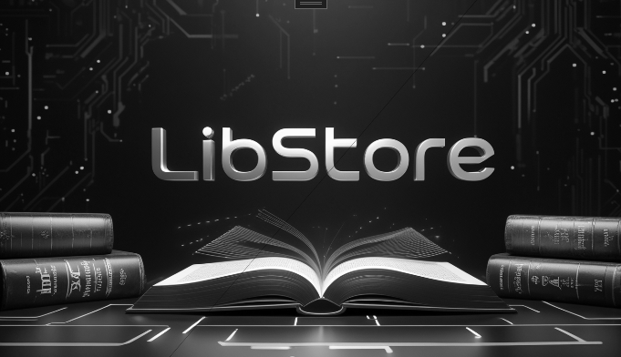
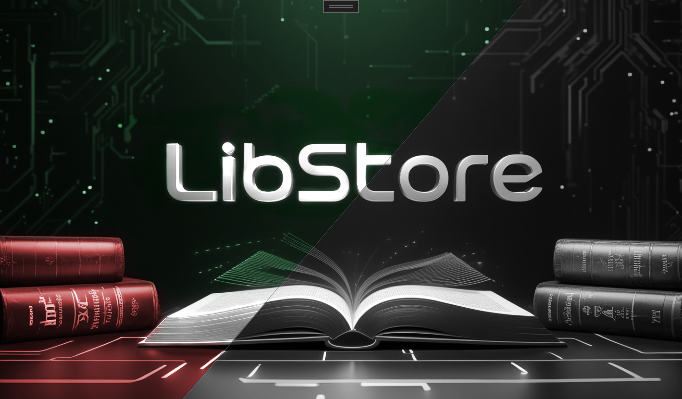
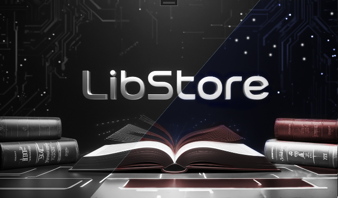

# 
LibStore

 ## A full-stack project that I am developing to practice and improve my skills.
 LibStore started as a quick portfolio project, but it has the potential to become an actually good product. This is why it will take a while to be finished, however the API is working good (still needs improvement and little refactoring). I am currently working on one of the clients (WPF) But its currently in very early stage.

 So here we got:
 - **WPF Client** - for local stores.
 - **Future React/Angular TS Client** - for online shoping.
- **ASP.NET Core Web API** - REST API and business logic in one project.
- **NUnit3 Test Project** - Unit tests for the server side. (will add RestSharp API tests in the future.)

# 
WPF Client

### 
Initial screen, user must select language.

<table align="center">
    <tr>
        <th>Bulgarian</th>
        <th>English</th>
    </tr>
    <tr>
        <td>
        <td>
</table>
### 
 After language is selected, the app displays loading screen, and checks API and DB connections.

 
